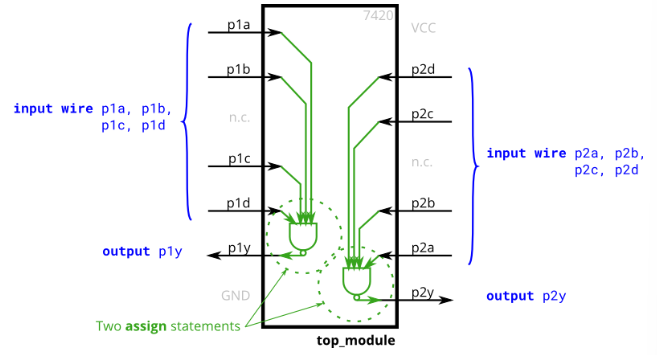

# Problem Statement

The 7400-series integrated circuits are a series of digital chips with a few gates each. The 7420 is a chip with two 4-input NAND gates.

Create a module with the same functionality as the 7420 chip. It has 8 inputs and 2 outputs.

