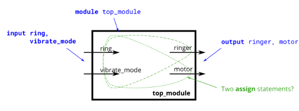

# Problem Statement

Suppose you are designing a circuit to control a cellphone's ringer and vibration motor. Whenever the phone needs to ring from an incoming call (input **ring**), your circuit must either turn on the ringer (output **ringer** = 1) or the motor (output **motor** = 1), but not both. If the phone is in vibrate mode (input **vibrate_mode** = 1), turn on the motor. Otherwise, turn on the ringer.

Try to use only assign statements, to see whether you can translate a problem description into a collection of logic gates.

> [!TIP]
> **Design hint**: When designing circuits, one often has to think of the problem "backwards", starting from the outputs then working backwards towards the inputs. This is often the opposite of how one would think about a (sequential, imperative) programming problem, where one would look at the inputs first then decide on an action (or output). For sequential programs, one would often think "If (inputs are ___ ) then (output should be ___ )". On the other hand, hardware designers often think "The (output should be ___ ) when (inputs are ___ )".
>
> The above problem description is written in an imperative form suitable for software programming (if ring then do this), so you must convert it to a more declarative form suitable for hardware implementation (assign ringer = ___). Being able to think in, and translate between, both styles is one of the most important skills needed for hardware design.