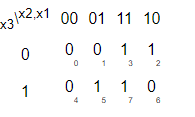
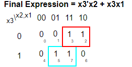

# problem statement

In the previous exercises, we used simple logic gates and combinations of several logic gates. These circuits are examples of combinational circuits. Combinational means the outputs of the circuit is a function (in the mathematics sense) of only its inputs. This means that for any given input value, there is only one possible output value. Thus, one way to describe the behaviour of a combinational function is to explicitly list what the output should be for every possible value of the inputs. This is a truth table.

For a boolean function of N inputs, there are 2N possible input combinations. Each row of the truth table lists one input combination, so there are always 2N rows. The output column shows what the output should be for each input value.

| x3 | x2 | x1 | f |
|----|----|----|---|
| 0  | 0  | 0  | 0 |
| 0  | 0  | 1  | 0 |
| 0  | 1  | 0  | 1 |
| 0  | 1  | 1  | 1 |
| 1  | 0  | 0  | 0 |
| 1  | 0  | 1  | 1 |
| 1  | 1  | 0  | 0 |
| 1  | 1  | 1  | 1 |

Create a combinational circuit that implements the above truth table.

> [!TIP]
> Minterm = ∑m(2,3,5,7)
> 
> 
> 
> 