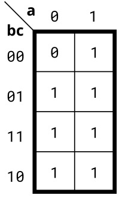

# Problem Statement

Implement the circuit described by the Karnaugh map below.

Try to simplify the k-map before coding it. Try both product-of-sums and sum-of-products forms. We can't check whether you have the optimal simplification of the k-map. But we can check if your reduction is equivalent, and we can check whether you can translate a k-map into a circuit.

> [!TIP]
> You can find how to solve K-Maps [here](). <- will update soon.