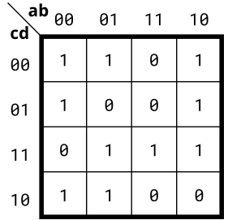
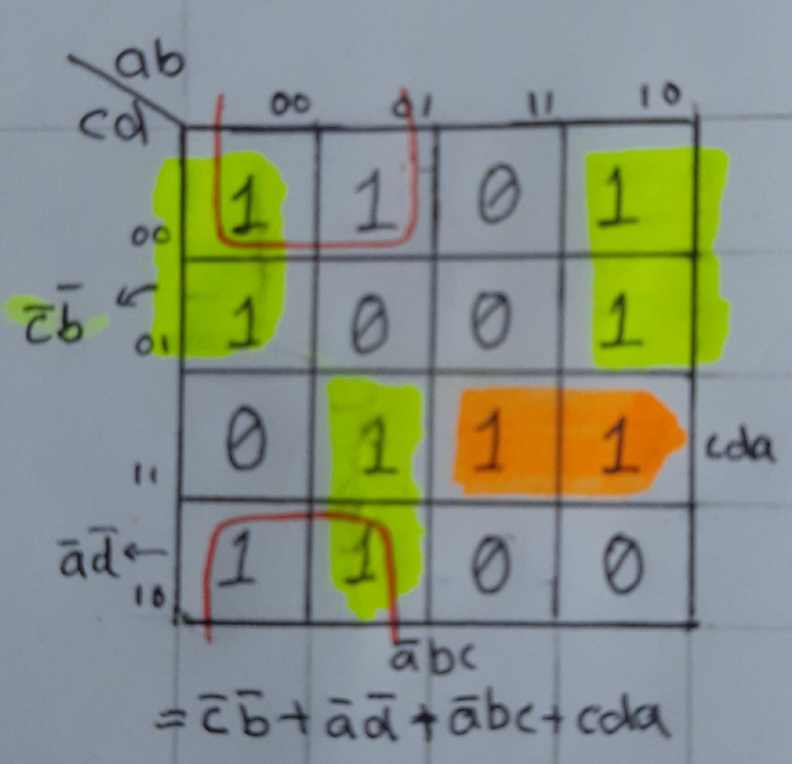
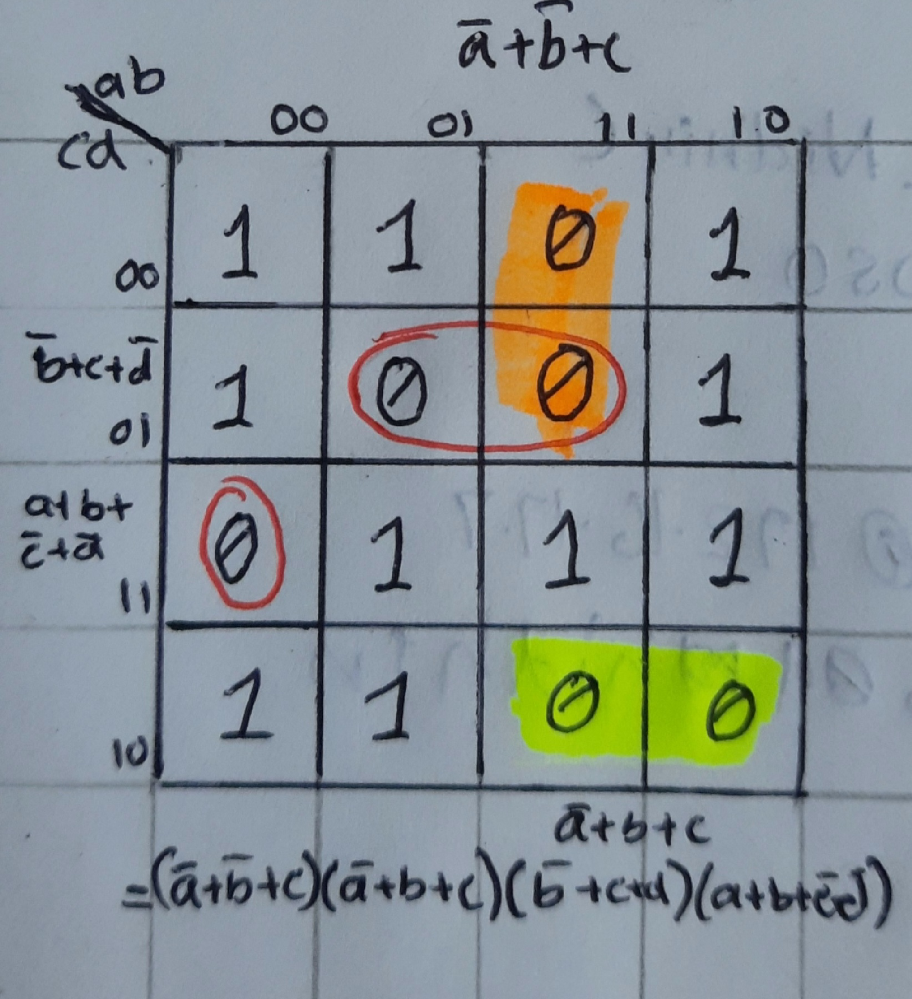

# Problem Statement

Implement the circuit described by the Karnaugh map below.

    
<h3> Solution </h3>

The problem can be done in both POS and SOP 

**SOP**

Out = $(\overline{c}.\overline{b})+(\overline{a}.\overline{d})+(\overline{a}.b.c)+(c.d.a)$

**POS**

Out = $(\overline{a}+\overline{b}+\overline{c}).(\overline{a}+b+c).(\overline{b}+c+d).(a+b+\overline{c}+\overline{d})$

Find the verilog file [here](solution_verilog.v)

