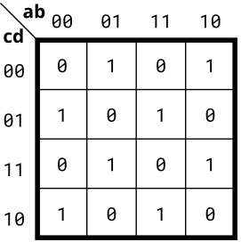

# Problem Statement

Implement the circuit described by the Karnaugh map below.

    
<h3> Solution </h3>

Here no grouping can be done in kmap, but on observation we can find that output is high on all odd minterms. So output is nothing but XOR (^) of all inputs. 

