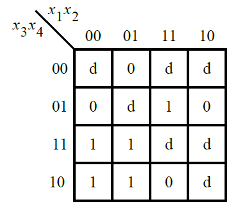
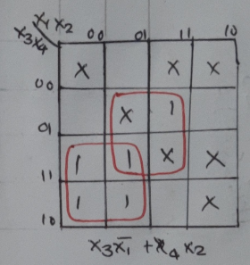

# Problem Statement

Consider the function f shown in the Karnaugh map below:

Implement this function. d is don't-care, which means you may choose to output whatever value is convenient.

    
<h3> Solution </h3>

$OUT = X_3 \overline{X_1}+X_4X_2$

Find the verilog file [here](solution_verilog.v)

