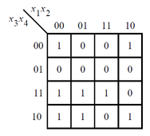
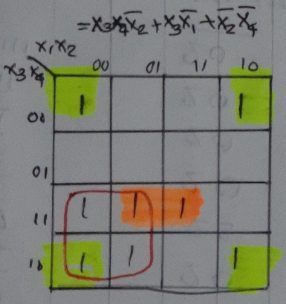

# Problem Statement

Consider the function f shown in the Karnaugh map below. Implement this function.

    
<h3> Solution </h3>

$F = X_3X_4\overline{X_2}+X_3\overline{X_1}+\overline{X_2}\overline{X_4}$

Find the verilog file [here](solution_verilog.v)

