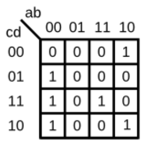
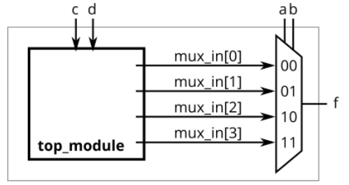
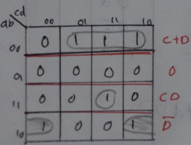

# Problem Statement

For the following Karnaugh map, give the circuit implementation using one 4-to-1 multiplexer and as many 2-to-1 multiplexers as required, but using as few as possible. You are not allowed to use any other logic gate and you must use a and b as the multiplexer selector inputs, as shown on the 4-to-1 multiplexer below.

You are implementing just the portion labelled top_module, such that the entire circuit (including the 4-to-1 mux) implements the K-map.

*(The requirement to use only 2-to-1 multiplexers exists because the original exam question also wanted to test logic function simplification using K-maps and how to synthesize logic functions using only multiplexers. If you wish to treat this as purely a Verilog exercise, you may ignore this constraint and write the module any way you wish.)*

    
<h3> Solution </h3>

- INPUT 0 = $C + D$
- INPUT 1 = $0$
- INPUT 2 = $\overline{D}$
- INPUT 3 = $C . D$

Find the verilog file [here](solution_verilog.v)

