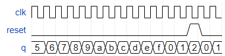

# Problem Statement

Build a 4-bit binary counter that counts from 0 through 15, inclusive, with a period of 16. The reset input is synchronous, and should reset the counter to 0.

[Find the verilog solution here](solution_verilog.v)