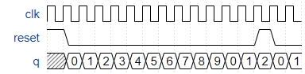

# Problem Statement

Build a decade counter that counts from 0 through 9, inclusive, with a period of 10. The reset input is synchronous, and should reset the counter to 0.

[Find the verilog solution here](solution_verilog.v)
