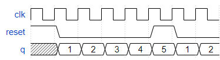

# Problem Statement

Make a decade counter that counts 1 through 10, inclusive. The reset input is synchronous, and should reset the counter to 1.

[Find the verilog solution here](solution_verilog.v)