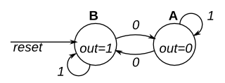

# Simple FSM 1 (synchrounous)

This is a Moore state machine with two states, one input, and one output. Implement this state machine. Notice that the reset state is B.

This exercise is the same as [previous](<../01. Simple FSM 1 (async reset)>), but using synchronous reset.

Solution --> [FSM Design]()  
