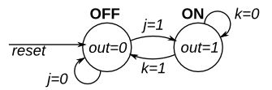

# FSM 2

This is a Moore state machine with two states, two inputs, and one output. Implement this state machine.

Yes, there are ways to do this other than writing an FSM. This is a JK flip-flop.

**[Solution](solution_verilog.v)**