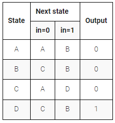

# Simple State Transition 3

The following is the state transition table for a Moore state machine with one input, one output, and four states. Use the following state encoding: A=2'b00, B=2'b01, C=2'b10, D=2'b11.

**Implement only the state transition logic and output logic** (the combinational logic portion) for this state machine. Given the current state (state), compute the next_state and output (out) based on the state transition table.

**[Solution](solution_verilog.v)**
