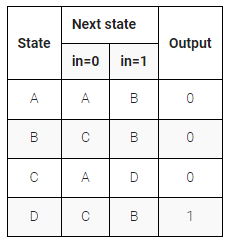

# One Hot FSM

The following is the state transition table for a Moore state machine with one input, one output, and four states. Use the following one-hot state encoding: A=4'b0001, B=4'b0010, C=4'b0100, D=4'b1000.

**Derive state transition and output logic equations by inspection assuming a one-hot encoding**. Implement only the state transition logic and output logic (the combinational logic portion) for this state machine. (The testbench will test with non-one hot inputs to make sure you're not trying to do something more complicated).

### What does "derive equations by inspection" mean?

One-hot state machine encoding guarantees that exactly one state bit is 1. This means that it is possible to determine whether the state machine is in a particular state by examining only one state bit, not all state bits. This leads to simple logic equations for the state transitions by examining the incoming edges for each state in the state transition diagram.

For example, in the above state machine, how can the state machine can reach state A? It must use one of the two incoming edges: "Currently in state A and in=0" or "Currently in state C and in = 0". Due to the one-hot encoding, the logic equation to test for "currently in state A" is simply the state bit for state A. This leads to the final logic equation for the next state of state bit A: next_state[0] = state[0]&(~in) | state[2]&(~in). The one-hot encoding guarantees that at most one clause (product term) will be "active" at a time, so the clauses can just be ORed together.

When an exercise asks for state transition equations "by inspection", use this particular method. The judge will test with non-one-hot inputs to ensure your logic equations follow this method, rather that doing something else (such as resetting the FSM) for illegal (non-one-hot) combinations of the state bits.

Although knowing this algorithm isn't necessary for RTL-level design (the logic synthesizer handles this), it is illustrative of why one-hot FSMs often have simpler logic (at the expense of more state bit storage), and this topic frequently shows up on exams in digital logic courses.

Logic equations for one-hot state transition logic can be derived by looking at in-edges of the state transition diagram.
