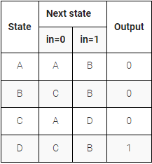
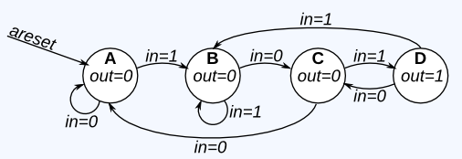

# Simple FSM 3

The following is the state transition table for a Moore state machine with one input, one output, and four states. Implement this state machine. Include an asynchronous reset that resets the FSM to state A.

