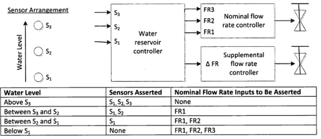
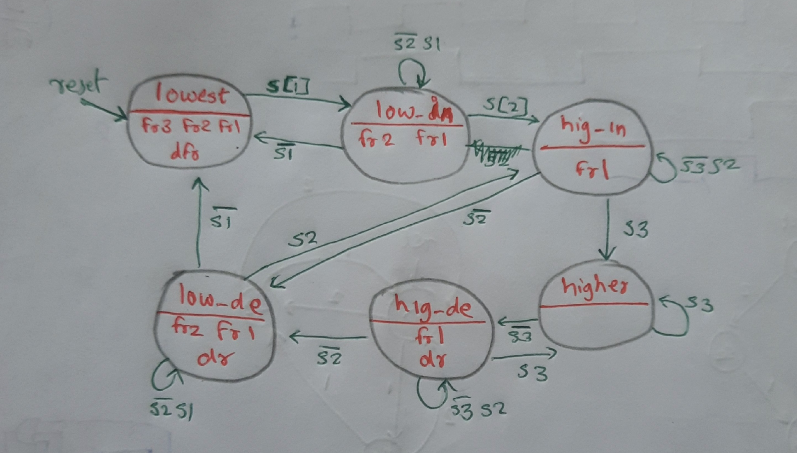

# Build a Moore FSM

A large reservoir of water serves several users. In order to keep the level of water sufficiently high, three sensors are placed vertically at 5-inch intervals. When the water level is above the highest sensor (S3), the input flow rate should be zero. When the level is below the lowest sensor (S1), the flow rate should be at maximum (both Nominal flow valve and Supplemental flow valve opened). The flow rate when the level is between the upper and lower sensors is determined by two factors: the water level and the level previous to the last sensor change. Each water level has a nominal flow rate associated with it, as shown in the table below. If the sensor change indicates that the previous level was lower than the current level, the nominal flow rate should take place. Ifthe previous level was higher than the current level, the flow rate should be increased by opening the Supplemental flow valve (controlled by dFR). Draw the Moore model state diagram for the water reservoir controller. Clearly indicate all state transitions and outputs for each state. The inputs to your FSM are Sl, S2 and S; the outputs are FR1, FR2, FR3 and dFR.

Also include an active-high synchronous reset that resets the state machine to a state equivalent to if the water level had been low for a long time (no sensors asserted, and all four outputs asserted).

[Solution](solution_verilog.v)