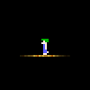
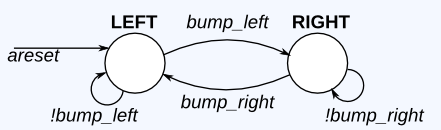

# Lemming 1

The game Lemmings involves critters with fairly simple brains. So simple that we are going to model it using a finite state machine.

In the Lemmings' 2D world, Lemmings can be in one of two states: walking left or walking right. It will switch directions if it hits an obstacle. In particular, if a Lemming is bumped on the left, it will walk right. If it's bumped on the right, it will walk left. If it's bumped on both sides at the same time, it will still switch directions.

Implement a Moore state machine with two states, two inputs, and one output that models this behaviour.

[Solution](solution_verilog.v)