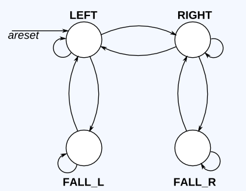

# Lemming 2

In addition to walking left and right, Lemmings will fall (and presumably go "aaah!") if the ground disappears underneath them.

In addition to walking left and right and changing direction when bumped, when ground=0, the Lemming will fall and say "aaah!". When the ground reappears (ground=1), the Lemming will resume walking in the same direction as before the fall. Being bumped while falling does not affect the walking direction, and being bumped in the same cycle as ground disappears (but not yet falling), or when the ground reappears while still falling, also does not affect the walking direction.

Build a finite state machine that models this behaviour.

[Solution]()