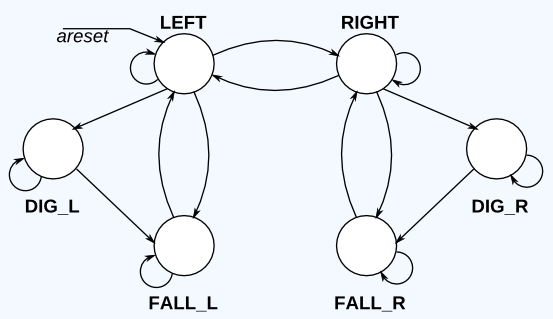

# Lemming 3

In addition to walking and falling, Lemmings can sometimes be told to do useful things, like dig (it starts digging when dig=1). A Lemming can dig if it is currently walking on ground (ground=1 and not falling), and will continue digging until it reaches the other side (ground=0). At that point, since there is no ground, it will fall (aaah!), then continue walking in its original direction once it hits ground again. As with falling, being bumped while digging has no effect, and being told to dig when falling or when there is no ground is ignored.

(In other words, a walking Lemming can fall, dig, or switch directions. If more than one of these conditions are satisfied, fall has higher precedence than dig, which has higher precedence than switching directions.)

Extend your finite state machine to model this behaviour.

