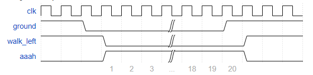

# Leamming 4

Although Lemmings can walk, fall, and dig, Lemmings aren't invulnerable. If a Lemming falls for too long then hits the ground, it can splatter. In particular, if a Lemming falls for more than 20 clock cycles then hits the ground, it will splatter and cease walking, falling, or digging (all 4 outputs become 0), forever (Or until the FSM gets reset). There is no upper limit on how far a Lemming can fall before hitting the ground. Lemmings only splatter when hitting the ground; they do not splatter in mid-air.

Extend your finite state machine to model this behaviour.

Falling for 20 cycles is survivable:

Falling for 21 cycles causes splatter:

Use the FSM to control a counter that tracks how long the Lemming has been falling.

## [Solution](solution_verilog.v)
