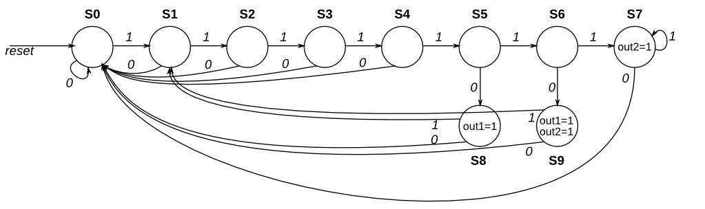

# One Hot FSM

Given the following state machine with 1 input and 2 outputs:

Suppose this state machine uses one-hot encoding, where state[0] through state[9] correspond to the states S0 though S9, respectively. The outputs are zero unless otherwise specified.

Implement the state transition logic and output logic portions of the state machine (but not the state flip-flops). You are given the current state in state[9:0] and must produce next_state[9:0] and the two outputs. Derive the logic equations by inspection assuming a one-hot encoding. (The testbench will test with non-one hot inputs to make sure you're not trying to do something more complicated).

## [solution](solution_verilog.v)
