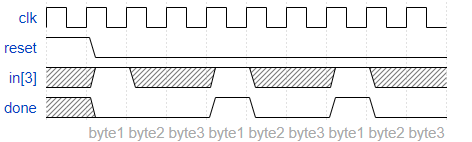
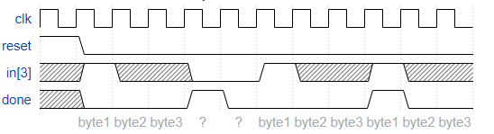
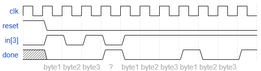

# PS2 Packet Parser

The PS/2 mouse protocol sends messages that are three bytes long. However, within a continuous byte stream, it's not obvious where messages start and end. The only indication is that the first byte of each three byte message always has bit[3]=1 (but bit[3] of the other two bytes may be 1 or 0 depending on data).

We want a finite state machine that will search for message boundaries when given an input byte stream. The algorithm we'll use is to discard bytes until we see one with bit[3]=1. We then assume that this is byte 1 of a message, and signal the receipt of a message once all 3 bytes have been received (done).

The FSM should signal done in the cycle immediately after the third byte of each message was successfully received.

## Some timing diagrams to explain the desired behaviour

Under error-free conditions, every three bytes form a message:

When an error occurs, search for byte 1:

Note that this is not the same as a 1xx sequence recognizer. Overlapping sequences are not allowed here:

### [Solution](solution_verilog.v)