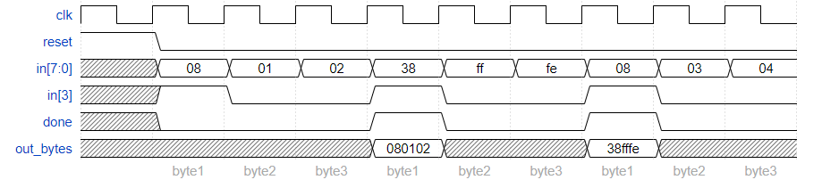

# PS2 Packet Parser and Datapath

Now that you have a state machine that will identify three-byte messages in a PS/2 byte stream, add a datapath that will also output the 24-bit (3 byte) message whenever a packet is received (out_bytes[23:16] is the first byte, out_bytes[15:8] is the second byte, etc.).

out_bytes needs to be valid whenever the done signal is asserted. You may output anything at other times (i.e., don't-care).

For example

