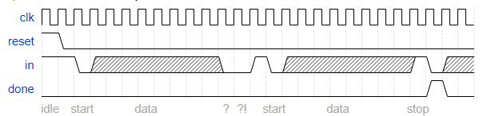

# Serial Receiver

In many (older) serial communications protocols, each data byte is sent along with a start bit and a stop bit, to help the receiver delimit bytes from the stream of bits. One common scheme is to use one start bit (0), 8 data bits, and 1 stop bit (1). The line is also at logic 1 when nothing is being transmitted (idle).

Design a finite state machine that will identify when bytes have been correctly received when given a stream of bits. It needs to identify the start bit, wait for all 8 data bits, then verify that the stop bit was correct. If the stop bit does not appear when expected, the FSM must wait until it finds a stop bit before attempting to receive the next byte.

## Some timing diagrams

Error-free:

Stop bit not found. First byte is discarded:

