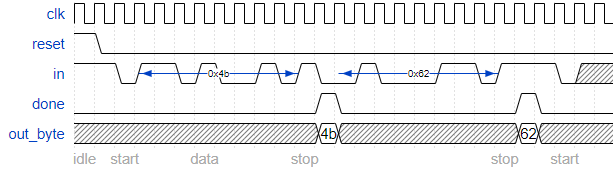

# Serial Receiver with Datapath

Now that you have a finite state machine that can identify when bytes are correctly received in a serial bitstream, add a datapath that will output the correctly-received data byte. out_byte needs to be valid when done is 1, and is don't-care otherwise.

Note that the serial protocol sends the least significant bit first.

## Some timing diagrams

Error-free:

