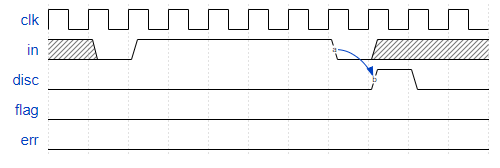
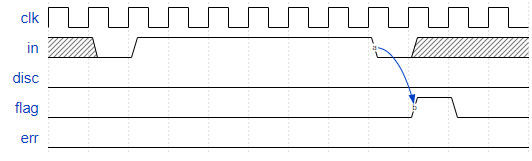
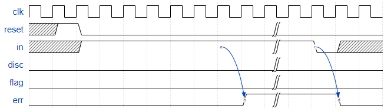
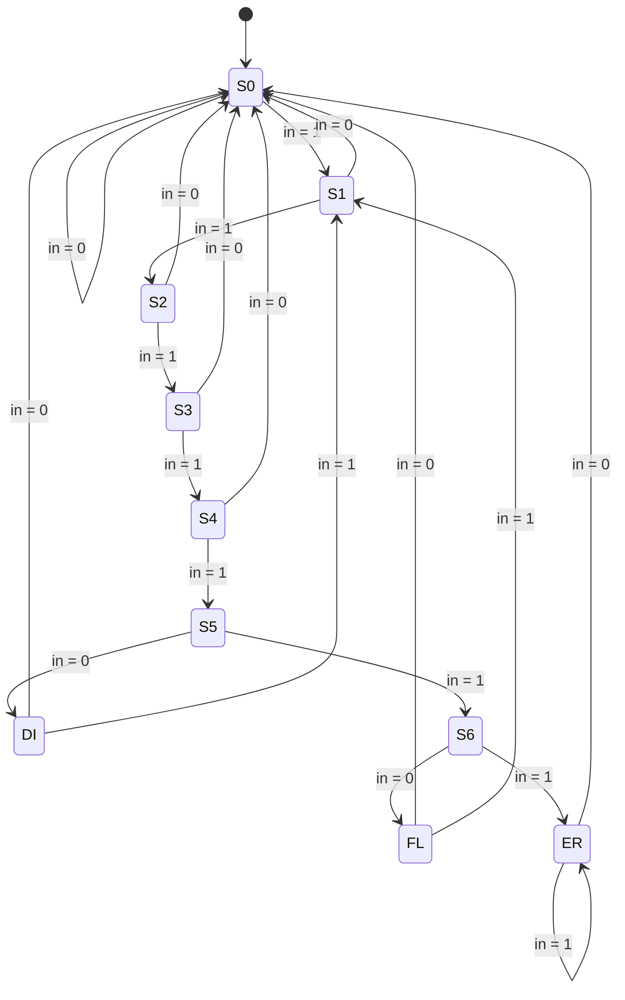

# Sequence Detector

Synchronous HDLC framing involves decoding a continuous bit stream of data to look for bit patterns that indicate the beginning and end of frames (packets). Seeing exactly 6 consecutive 1s (i.e., 01111110) is a "flag" that indicate frame boundaries. To avoid the data stream from accidentally containing "flags", the sender inserts a zero after every 5 consecutive 1s which the receiver must detect and discard. We also need to signal an error if there are 7 or more consecutive 1s.

Create a finite state machine to recognize these three sequences:

- 0111110: Signal a bit needs to be discarded (disc).
- 01111110: Flag the beginning/end of a frame (flag).
- 01111111...: Error (7 or more 1s) (err).

When the FSM is reset, it should be in a state that behaves as though the previous input were 0.

**Here are some example sequences that illustrate the desired operation.**

Discard 0111110:

Flag 01111110:

Reset behaviour and error 01111111...:

## Solution

[**Verilog code**](solution.v)

