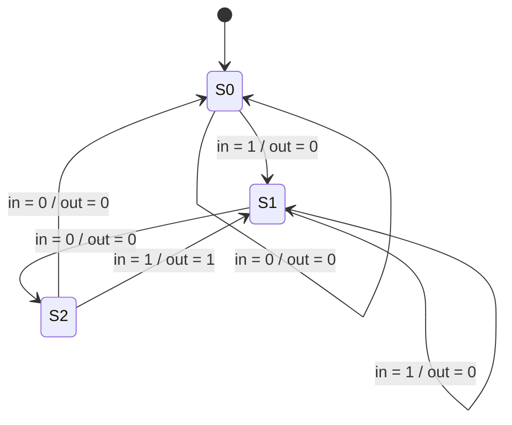

# Mealy FSM

Implement a Mealy-type finite state machine that recognizes the sequence "101" on an input signal named x. Your FSM should have an output signal, z, that is asserted to logic-1 when the "101" sequence is detected. Your FSM should also have an active-low asynchronous reset. You may only have 3 states in your state machine. Your FSM should recognize overlapping sequences.

## Solution

