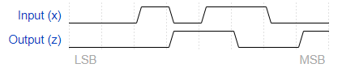
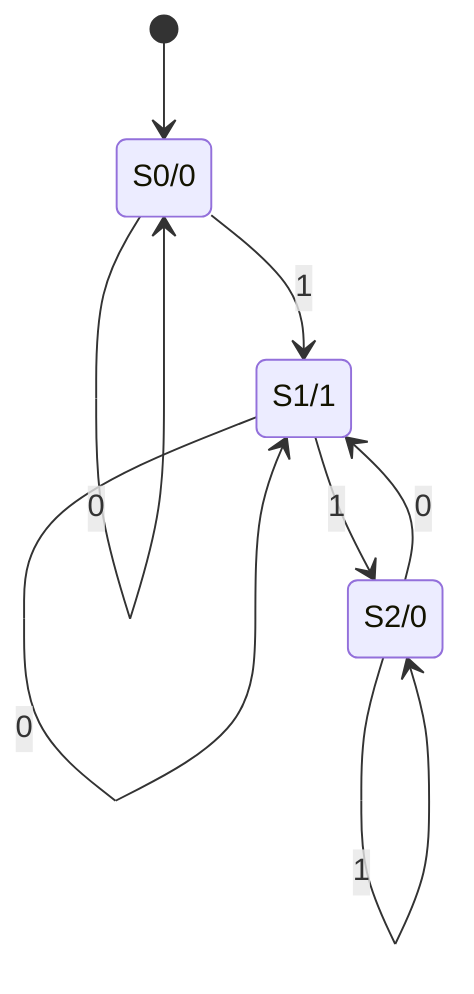

# Serial Twos Complement (moore)

You are to design a one-input one-output serial 2's complementer Moore state machine. The input (x) is a series of bits (one per clock cycle) beginning with the least-significant bit of the number, and the output (Z) is the 2's complement of the input. The machine will accept input numbers of arbitrary length. The circuit requires an asynchronous reset. The conversion begins when Reset is released and stops when Reset is asserted.

For example:

## Solution

