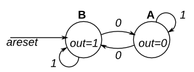

# Simple FSM 1

This is a Moore state machine with two states, one input, and one output. Implement this state machine. Notice that the reset state is B.

**Solution -> [FSM Design](solution_verilog.v)**

Yes, there are ways to do this other than writing an FSM. This is a TFF with the T input inverted.
