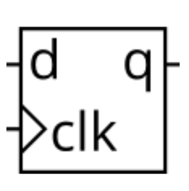

# Problem Statment

A D flip-flop is a circuit that stores a bit and is updated periodically, at the (usually) positive edge of a clock signal.

Dff.png
D flip-flops are created by the logic synthesizer when a clocked always block is used. A D flip-flop is the simplest form of "blob of combinational logic followed by a flip-flop" where the combinational logic portion is just a wire.

**Create a single D flip-flop.**

[Find the verilog Solution](solution_verilog.v)

