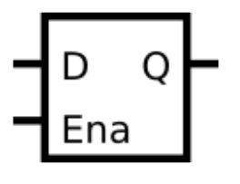

# Problem Statement

Implement the following circuit:

> [!NOTE]
> this is a latch, so a Quartus warning about having inferred a latch is expected.

[Find the verilog Solution](solution_verilog.v)

- Latches are level-sensitive (not edge-sensitive) circuits, so in an always block, they use level-sensitive sensitivity lists.
- However, they are still sequential elements, so should use non-blocking assignments.
- A D-latch acts like a wire (or non-inverting buffer) when enabled, and preserves the current value when disabled.