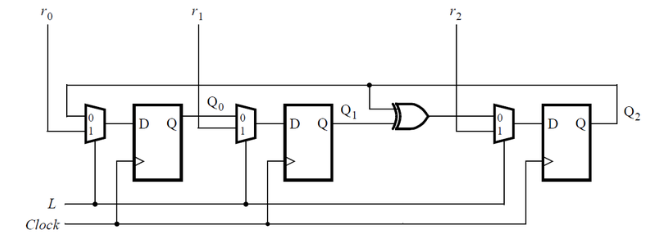

# Problem Statement

Consider the sequential circuit below:

Assume that you want to implement hierarchical Verilog code for this circuit, using three instantiations of a submodule that has a flip-flop and multiplexer in it. Write a Verilog module (containing one flip-flop and multiplexer) named top_module for this submodule.

[Find the verilog Solution](solution_verilog.v)
