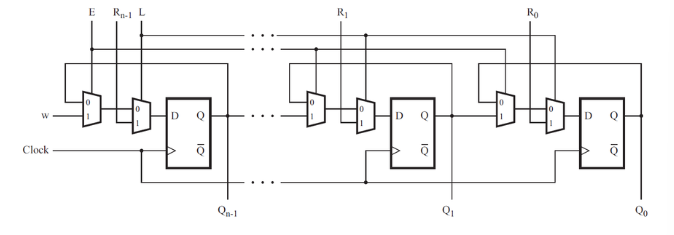

# Problem Statement

Consider the n-bit shift register circuit shown below:

Write a Verilog module named top_module for one stage of this circuit, including both the flip-flop and multiplexers.

Answer [here](solution_verilog.v)