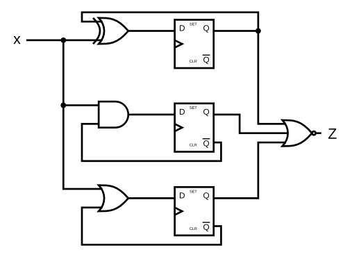

# Problem Statement

Given the finite state machine circuit as shown, assume that the D flip-flops are initially reset to zero before the machine begins.

Build this circuit.

[Find the verilog Solution](solution_verilog.v)
