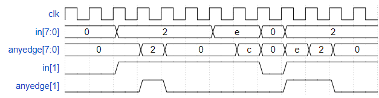

# Problem Statement

For each bit in an 8-bit vector, detect when the input signal changes from one clock cycle to the next (detect any edge). The output bit should be set the cycle after a 0 to 1 transition occurs.

Here are some examples. For clarity, in[1] and anyedge[1] are shown separately

[Find the verilog Solution](solution_verilog.v)
