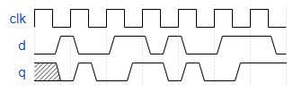

# Problem Statement

You're familiar with flip-flops that are triggered on the positive edge of the clock, or negative edge of the clock. A dual-edge triggered flip-flop is triggered on both edges of the clock. However, FPGAs don't have dual-edge triggered flip-flops, and always @(posedge clk or negedge clk) is not accepted as a legal sensitivity list.

Build a circuit that functionally behaves like a dual-edge triggered flip-flop:

> [!NOTE]
> It's not necessarily perfectly equivalent: The output of flip-flops have no glitches, but a larger combinational circuit that emulates this behaviour might. But we'll ignore this detail here.