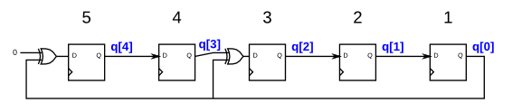

# Problem Statement

A linear feedback shift register is a shift register usually with a few XOR gates to produce the next state of the shift register. A Galois LFSR is one particular arrangement where bit positions with a "tap" are XORed with the output bit to produce its next value, while bit positions without a tap shift. If the taps positions are carefully chosen, the LFSR can be made to be "maximum-length". A maximum-length LFSR of n bits cycles through 2n-1 states before repeating (the all-zero state is never reached).

The following diagram shows a 5-bit maximal-length Galois LFSR with taps at bit positions 5 and 3. (Tap positions are usually numbered starting from 1). Note that I drew the XOR gate at position 5 for consistency, but one of the XOR gate inputs is 0.

Build this LFSR. The reset should reset the LFSR to 1.