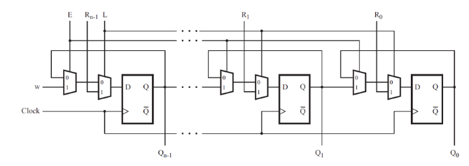

Consider the n-bit shift register circuit shown below:

Write a top-level Verilog module (named top_module) for the shift register, assuming that n = 4. Instantiate four copies of your MUXDFF subcircuit in your top-level module. Assume that you are going to implement the circuit on the DE2 board.

- Connect the R inputs to the SW switches,
- clk to KEY[0],
- E to KEY[1],
- L to KEY[2], and
- w to KEY[3].
- Connect the outputs to the red lights LEDR[3:0].