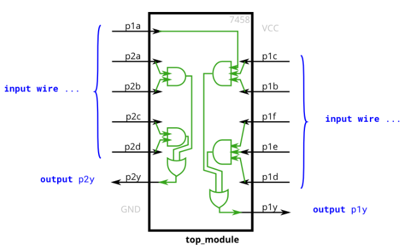

# Problem Statement

The 7458 is a chip with four AND gates and two OR gates. This problem is slightly more complex than [7420]().

Create a module with the same functionality as the 7458 chip. It has 10 inputs and 2 outputs. You may choose to use an assign statement to drive each of the output wires, or you may choose to declare (four) wires for use as intermediate signals, where each internal wire is driven by the output of one of the AND gates. For extra practice, try it both ways.

**Expected solution length**: Around 2–10 lines.