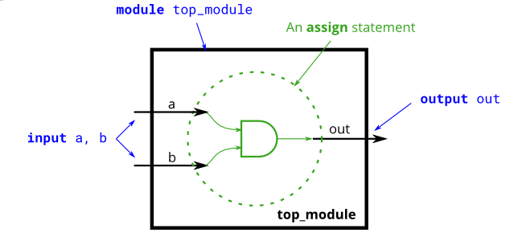

# Problem Statement

**Create a module that implements an AND gate.**

This circuit now has three wires (a, b, and out). Wires a and b already have values driven onto them by the input ports. But wire out currently is not driven by anything. Write an assign statement that drives out with the AND of signals a and b.

Note that this circuit is very similar to the [NOT gate](), just with one more input. If it sounds different, it's because I've started describing signals as being driven (has a known value determined by something attached to it) or not driven by something. Input wires are driven by something outside the module. assign statements will drive a logic level onto a wire. As you might expect, a wire cannot have more than one driver (what is its logic level if there is?), and a wire that has no drivers will have an undefined value (often treated as 0 when synthesizing hardware).



**Expected solution length**: Around 1 line.

given:
```
module top_module( 
    input a, 
    input b, 
    output out );
    // your solution here
end module    
```