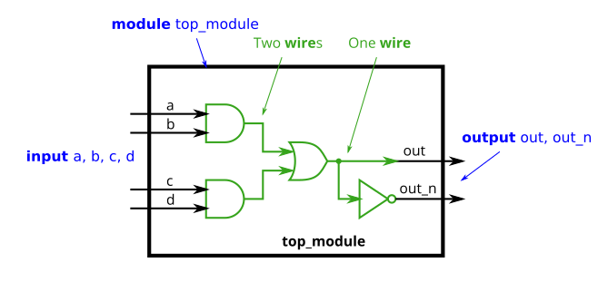
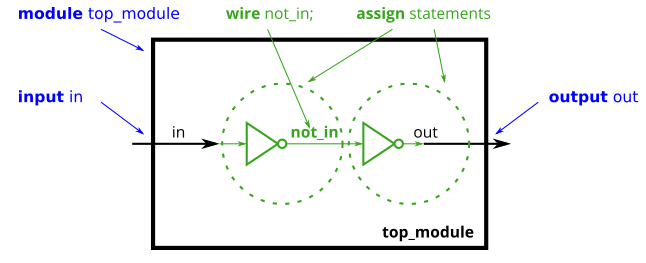

# Problem Statement

Implement the following circuit. **Create two intermediate wires** (named anything you want) to connect the AND and OR gates together. Note that the wire that feeds the NOT gate is really wire out, so you do not necessarily need to declare a third wire here. Notice how wires are driven by exactly one source (output of a gate), but can feed multiple inputs.

If you're following the circuit structure in the diagram, you should end up with four assign statements, as there are four signals that need a value assigned.

*(Yes, it is possible to create a circuit with the same functionality without the intermediate wires.)*



Expected solution length: Around 5 lines.

given:
```
module top_module(
    input a,
    input b,
    input c,
    input d,
    output out,
    output out_n   ); 

endmodule
```

### Hint

The circuits so far have been simple enough that the outputs are simple functions of the inputs. As circuits become more complex, you will need wires to connect internal components together. When you need to use a wire, you should declare it in the body of the module, somewhere before it is first used. (In the future, you will encounter more types of signals and variables that are also declared the same way, but for now, we'll start with a signal of type wire).

### Example



```
module top_module (
    input in,              // Declare an input wire named "in"
    output out             // Declare an output wire named "out"
);

    wire not_in;           // Declare a wire named "not_in"

    assign out = ~not_in;  // Assign a value to out (create a NOT gate).
    assign not_in = ~in;   // Assign a value to not_in (create another NOT gate).

endmodule   // End of module "top_module"
```

In the above module, there are three wires (in, out, and not_in), two of which are already declared as part of the module's input and output ports (This is why you didn't need to declare any wires in the earlier exercises). The wire not_in needs to be declared inside the module. It is not visible from outside the module. Then, two NOT gates are created using two assign statements. Note that it doesn't matter which of the NOT gates you create first: You still end up with the same circuit.