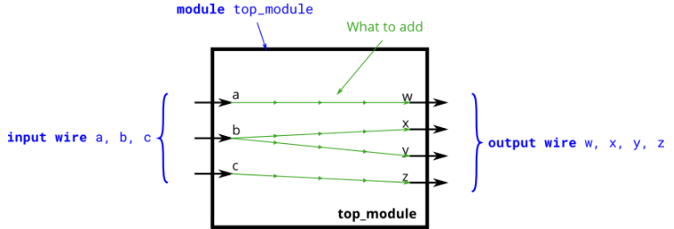

# Problem Statement

Create a module with 3 inputs and 4 outputs that behaves like wires that makes these connections:

>a -> w 
>
>b -> x
>
>b -> y
>
>c -> z

The diagram below illustrates how each part of the circuit corresponds to each bit of Verilog code. From outside the module, there are three input ports and four output ports.

When you have multiple assign statements, the **order** in which they appear in the code **does not matter**. Unlike a programming language, assign statements ("continuous assignments") describe connections between things, not the action of copying a value from one thing to another.

One potential source of confusion that should perhaps be clarified now: The green arrows here represent connections between wires, but are not wires in themselves. The module itself already has 7 wires declared (named a, b, c, w, x, y, and z). This is because input and output declarations actually declare a wire unless otherwise specified. Writing input wire a is the same as input a. Thus, the assign statements are not creating wires, they are creating the connections between the 7 wires that already exist.

**Expected solution length**: Around 4 lines.
