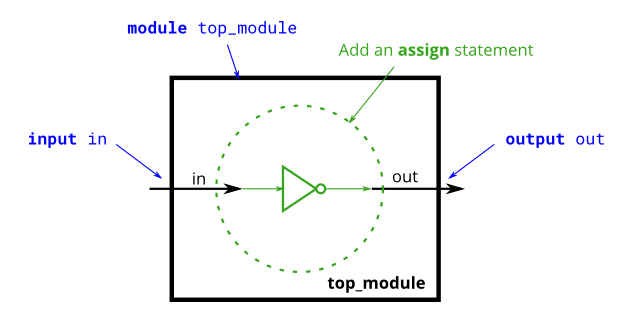

# Problem Statement

**Create a module that implements a NOT gate**.

This circuit is similar to [wire](), but with a slight difference. When making the connection from the wire in to the wire out we're going to implement an inverter (or "NOT-gate") instead of a plain wire.

Use an assign statement. The assign statement will continuously drive the inverse of in onto wire out.

**Expected solution length**: Around 1 line.