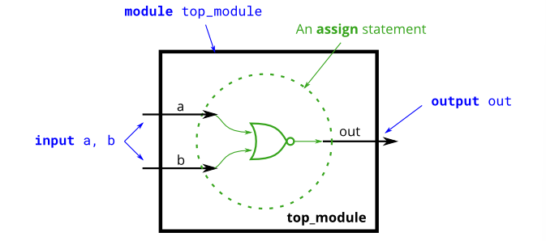

# Problem Statement

**Create a module that implements a NOR gate.** A NOR gate is an OR gate with its output inverted. A NOR function needs two operators when written in Verilog.

An assign statement drives a wire (or "net", as it's more formally called) with a value. This value can be as complex a function as you want, as long as it's a combinational (i.e., memory-less, with no hidden state) function. An assign statement is a continuous assignment because the output is "recomputed" whenever any of its inputs change, forever, much like a simple logic gate.



**Expected solution length**: Around 1 line.

given:
```
module top_module( 
    input a, 
    input b, 
    output out );
    // your souution here
endmodule
```
