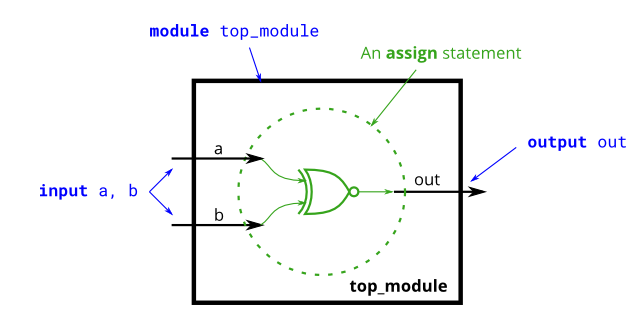

# Problem Statement

**Create a module that implements an XNOR gate.**



**Expected solution length**: Around 1 line.

given:
```
module top_module( 
    input a, 
    input b, 
    output out );

endmodule
```