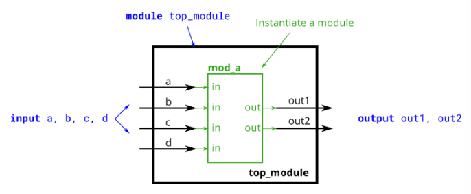

# Problem Statement


This problem is similar to the previous one ([module]()). You are given a module named mod_a that has 2 outputs and 4 inputs, in that order. You must connect the 6 ports by position to your top-level module's ports out1, out2, a, b, c, and d, in that order.

You are given the following module:

```verilog
module mod_a ( output, output, input, input, input, input );
```

