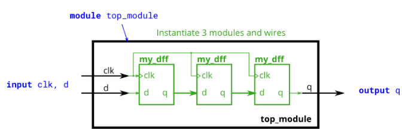

# Problem Statement

You are given a module my_dff with two inputs and one output (that implements a D flip-flop). Instantiate three of them, then chain them together to make a shift register of length 3. The clk port needs to be connected to all instances.

The module provided to you is: module my_dff ( input clk, input d, output q );

Note that to make the internal connections, you will need to declare some wires. Be careful about naming your wires and module instances: the names must be unique.

