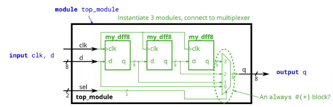

# Problem Statement

This exercise is an extension of [module_shift](https://github.com/Nidhinchandran47/HDLbits-Solutions/tree/main/Verilog%20Language/Modules%20Hierarchy/Module-shift8). Instead of module ports being only single pins, we now have modules with vectors as ports, to which you will attach wire vectors instead of plain wires. Like everywhere else in Verilog, the vector length of the port does not have to match the wire connecting to it, but this will cause zero-padding or trucation of the vector. This exercise does not use connections with mismatched vector lengths.

You are given a module my_dff8 with two inputs and one output (that implements a set of 8 D flip-flops). Instantiate three of them, then chain them together to make a 8-bit wide shift register of length 3. In addition, create a 4-to-1 multiplexer (not provided) that chooses what to output depending on sel[1:0]: The value at the input d, after the first, after the second, or after the third D flip-flop. (Essentially, sel selects how many cycles to delay the input, from zero to three clock cycles.)

The module provided to you is: module my_dff8 ( input clk, input [7:0] d, output [7:0] q );

The multiplexer is not provided. One possible way to write one is inside an always block with a case statement inside. (See also: [mux9to1v]())

